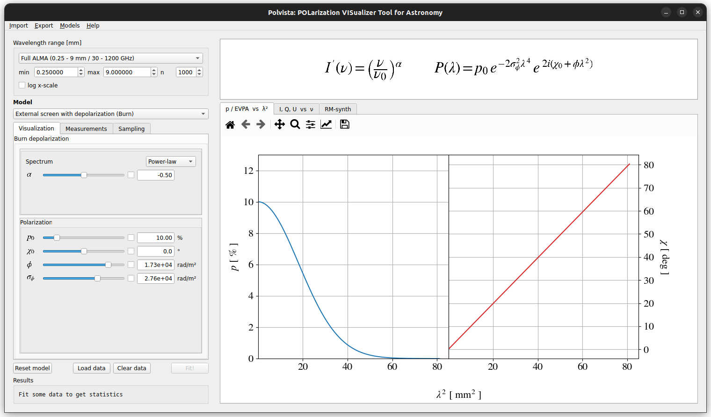

# `POLVISTA`

POLarization VISualizer Tool for Astronomy (`POLVISTA`) is an interactive visualizer to help get some intuition on complex polarization prescriptions used to model observations of Active Galactic Nuclei (AGN) and other astronomical objects.
Pick a model, customize its parameter, and watch how the degree of polarization and electric vector position angle (EVPA) changes across the spectrum.


`Polvista` can also fit spectropolarimetric data with either a simple least-squares regression. Just load some data, pick a model and set its parameters to a good initial guess, and then just click "Fit!"

### Included models for the Faraday screen:

- Burn depolarization (external screen)
- Tribble screen (partially resolved external screen)
- Internal uniform Faraday screen
- Partial coverage, external and internal
- Two-component blends: two external screens, two internal screens, or internal + external screens, each with independent spectral parameters
- Custom models to deal with arbitrary configurations of the emitting and Faraday rotating regions




### Simulating observations

Under the "Measurements" tab, the user will find a list of bands from the currently selected reference observatory set to represent each wavelength range. There, they can customize the spectral setup and set the systematic error scale for the Stokes parameters, and then click "Generate" to simulate what that observatory would measure given the specified model.

### RM-synthesis

Basic RM-synthesis and RM-clean routines are available for the user to check the Faraday structure from their own loaded data, or to see the predicted Faraday spectrum from any given model.


## Install

Requires Python >= 3.7.

```bash
git clone https://github.com/medoug7/polvista.git
cd polvista
pip install .
```

## Run

```bash
polvista
```

or, without installing a console script:

```bash
python -m polvista
```

## Development

```bash
pip install -e .
```

installs the package in editable mode so code changes are picked up without reinstalling.


### Bayesian sampling (optional)

In addition to least-squares fitting, polvista can run a full Bayesian nested-sampling fit via [pymultinest](https://github.com/JohannesBuchner/PyMultiNest), giving posterior distributions and Bayesian evidence for model comparison instead of a single best-fit point.

This is an optional feature that only becomes available if `pyMultiNest` is installed. `pyMultiNest` is a Python wrapper around the [MultiNest](https://github.com/JohannesBuchner/MultiNest) Fortran library. Installation instructions for both `multinest` and `pymultinest` are available in [this link](https://johannesbuchner.github.io/PyMultiNest/install.html).

To visualize the resulting posteriors as a corner plot, also install the [`corner`](https://corner.readthedocs.io/) package:

```bash
pip install .[bayes]
```


